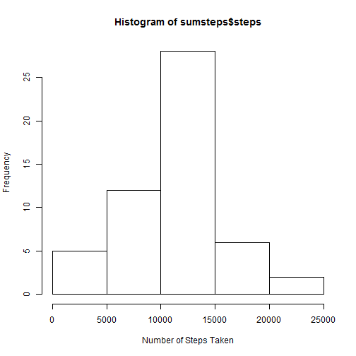
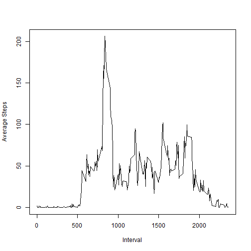
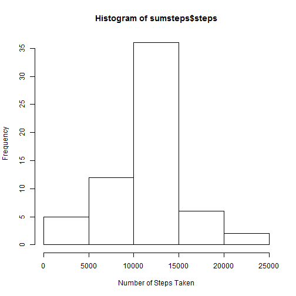
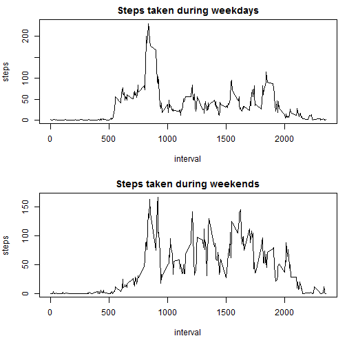

Project 1
===========

We are reading in the data and converting the date column to Date format


```r
data<-read.csv("activity.csv")
data$date<-as.Date(data$date,format="%Y-%m-%d")
```

We are aggregating the sum of steps per day, then showing the histogram and calculating the mean


```r
sumsteps<-aggregate(steps~date,sum,data=data)
hist(sumsteps$steps,xlab="Number of Steps Taken")
```

 

```r
mean(sumsteps$steps)
```

```
## [1] 10766.19
```

Aggregating the average steps taken on the specific time interval, plotting the time series and returning the time interval containing the max number of steps


```r
avesteps<-aggregate(steps~interval,mean,data=data)
plot(avesteps$steps~avesteps$interval,type="l",xlab="Interval",ylab="Average Steps")
```

 

```r
avesteps$interval[which.max(avesteps$steps)]
```

```
## [1] 835
```

Calculating the number of NAs, merging with the average steps table and rearranging the table  
Then substituting missing values with the average value (interval-wise)


```r
sum(is.na(data$steps))
```

```
## [1] 2304
```

```r
names(avesteps)<-c("interval","averagesteps")
data<-merge(data,avesteps,by="interval")
library(dplyr)
```

```
## 
## Attaching package: 'dplyr'
## 
## The following object is masked from 'package:stats':
## 
##     filter
## 
## The following objects are masked from 'package:base':
## 
##     intersect, setdiff, setequal, union
```

```r
data<-arrange(data,date,interval)
namatrix<-is.na(data$steps)
data$steps[namatrix]<-data$averagesteps[namatrix]
```

Finally deleting the new averagesteps colum, we get the original dataset


```r
data$averagesteps<-NULL
sumsteps<-aggregate(steps~date,sum,data=data)
hist(sumsteps$steps,xlab="Number of Steps Taken")
```

 

```r
mean(sumsteps$steps)
```

```
## [1] 10766.19
```

```r
median(sumsteps$steps)
```

```
## [1] 10766.19
```

There is no observable difference in the average and median number of steps taken each day. This is due to the substitution with the average which doesn't affect the general average.  

To work with English dates, we have to set the local system date preferences to English.

```r
Sys.setlocale("LC_TIME","English")
```

```
## [1] "English_United States.1252"
```

Now checking whether the specific day of week is weekend or not, storing it into the 'isweekend' variable, factoring it to fweekend and labeling the factors to 'weekday' and 'weekend'


```r
isweekend<-weekdays(data$date) %in% c("Sunday","Saturday")
data$fweekend<-factor(isweekend,labels=c("weekday","weekend"))
```

Aggregating according to weekend factor and interval, then plotting


```r
avesteps2<-aggregate(steps~interval+fweekend,mean,data=data)
par(mfrow=c(2,1),mar=c(5,4,2,1))
with(subset(avesteps2,fweekend=="weekday"),plot(steps~interval,type="l",main="Steps taken during weekdays"))
with(subset(avesteps2,fweekend=="weekend"),plot(steps~interval,type="l",main="Steps taken during weekends"))
```

 
